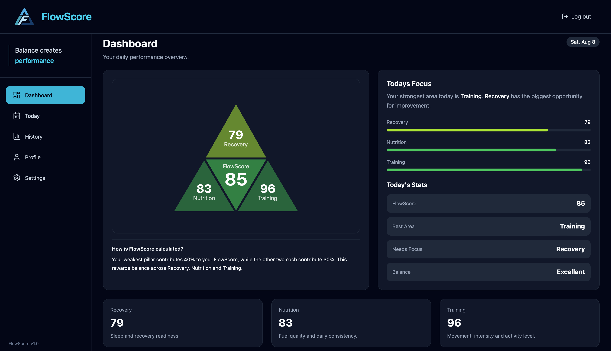
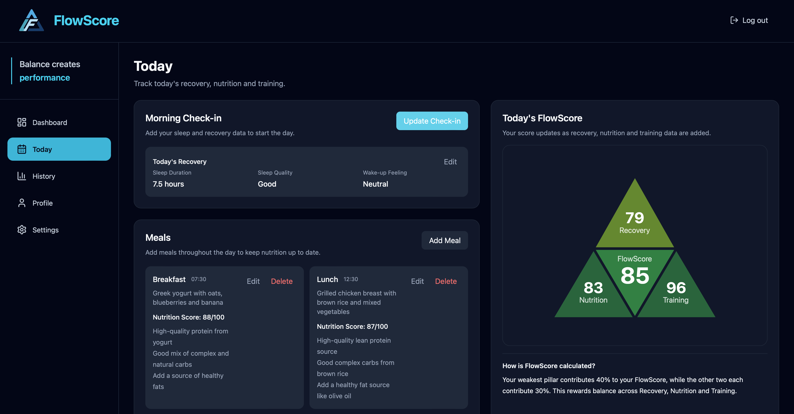
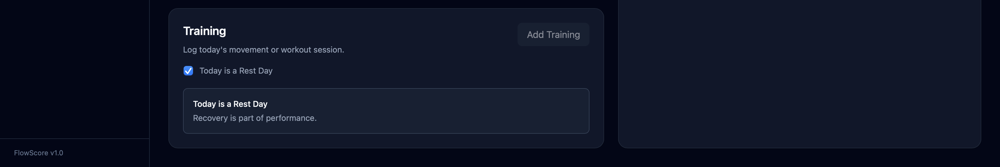
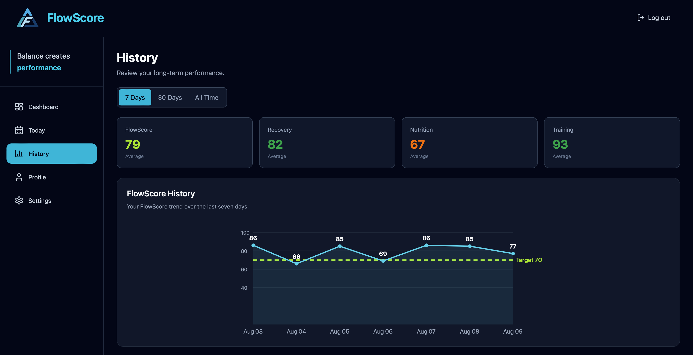
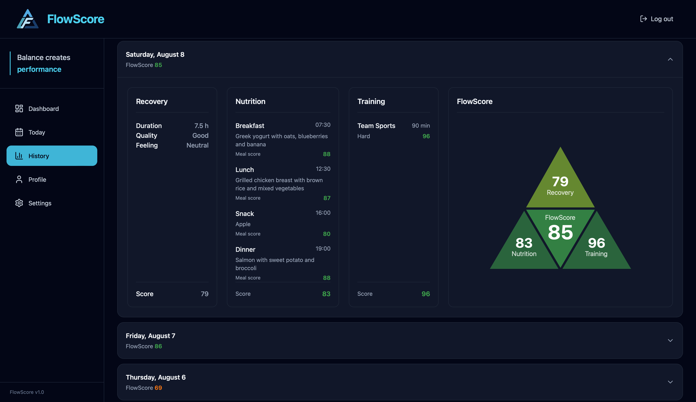
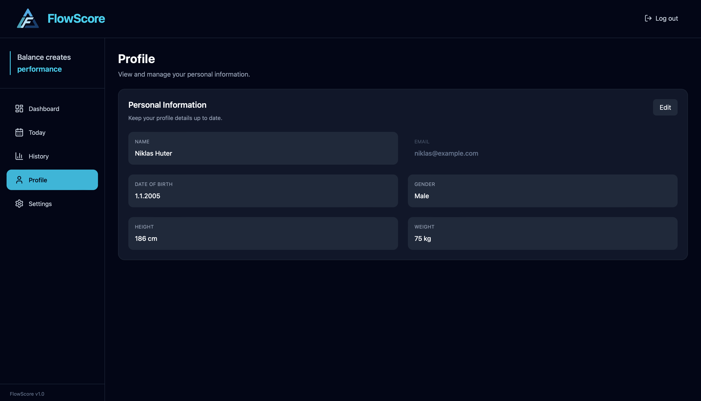
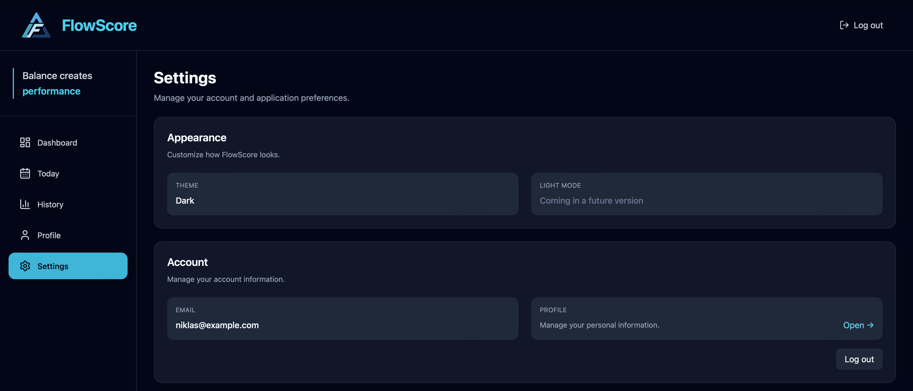
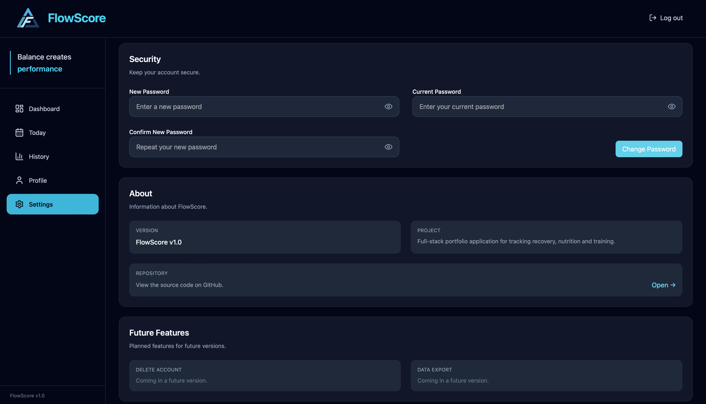
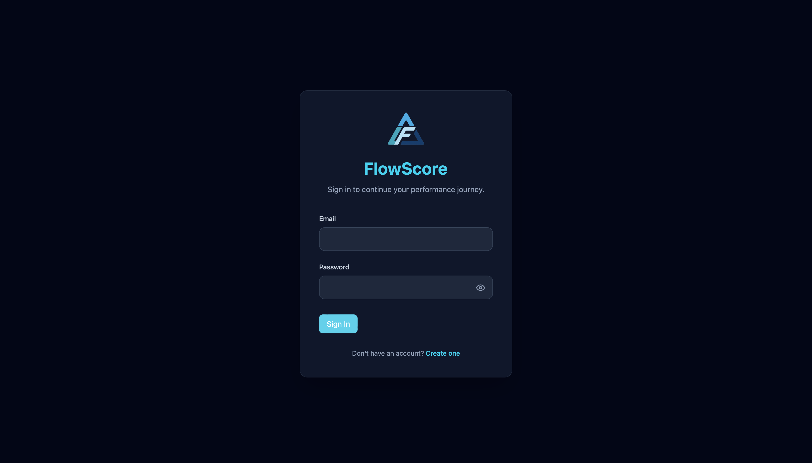
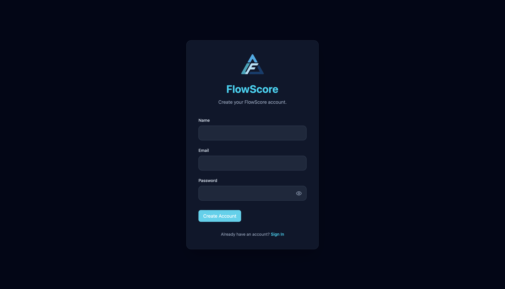

# FlowScore

> **Track recovery. Improve performance. Stay consistent.**

FlowScore is a modern full-stack web application that helps users monitor their recovery, nutrition and training in one place.

The application combines these three pillars into a daily **FlowScore** and uses **OpenAI** to analyze meals, calculate a nutrition score and generate personalized nutrition feedback.

Built with **React, TypeScript, ASP.NET Core 8, Entity Framework Core, SQLite and OpenAI**.

## Dashboard



The dashboard provides a daily overview of the user's recovery, nutrition, training and overall FlowScore, helping users identify strengths and areas for improvement at a glance.

## Core Features

- Secure JWT authentication
- Personal user accounts
- Daily recovery tracking
- AI-powered meal analysis and nutrition feedback
- Training tracking
- Daily FlowScore calculation
- Performance history and trends
- Profile management
- Password changes
- Modern, clean and intuitive UI

## Application Overview

### Today

The Today page allows users to record their daily recovery, meals and training. Meal entries are analyzed using OpenAI to generate a nutrition score and personalized feedback.





---

## History

The History page provides an overview of long-term performance, including FlowScore trends, average scores and detailed insights for each recorded day.

### Performance Trends



### Daily Details

Each day can be expanded to review the recorded recovery, nutrition, training and the calculated FlowScore.



---

### Profile

Users can manage their personal information while keeping their account securely linked to a read-only email address.



---

### Settings

The Settings page allows users to manage account security, change their password and access additional application settings.





---

### Authentication

FlowScore provides secure registration and login using JWT authentication and protected routes.

#### Login



#### Register




## Tech Stack

### Frontend

- React
- TypeScript
- Vite
- Tailwind CSS
- React Router
- Lucide React

### Backend

- ASP.NET Core 8 Web API
- Entity Framework Core 8
- ASP.NET Core Identity
- JWT Bearer Authentication
- Swagger (OpenAPI)

### Database

- SQLite

### AI Integration

- OpenAI API
  - Meal analysis
  - Nutrition scoring
  - Personalized nutrition feedback

## Architecture

```text
React Client
        │
        │ HTTP / JSON
        ▼
ASP.NET Core 8 Web API
        │
        ├── Controllers
        ├── Services
        ├── ASP.NET Core Identity
        ├── JWT Bearer Authentication
        └── Entity Framework Core
                │
                ▼
           SQLite Database

Meal analysis requests
        │
        ▼
    OpenAI API
```

The frontend communicates with the backend using HTTP requests and JSON.

Authentication is handled with ASP.NET Core Identity and JWT Bearer Authentication.

Entity Framework Core is used for data access with a SQLite database.

Meal descriptions are sent to the OpenAI API to generate a nutrition score and personalized nutrition feedback.

## Project Structure

```text
FlowScore
├── docs
│   └── images
├── src
│   ├── FlowScore.Api
│   └── FlowScore.Client
└── README.md
```

## Local Setup

### Prerequisites

- .NET 8 SDK
- Node.js
- npm

### Clone the repository

```bash
git clone https://github.com/niklashuter/FlowScore.git
cd FlowScore
```

### Backend

```bash
cd src/FlowScore.Api
dotnet restore
dotnet ef database update
dotnet run
```

### Frontend

```bash
cd src/FlowScore.Client
npm install
npm run dev
```

## Future Improvements

- Responsive mobile layout
- Live deployment
- PostgreSQL support
- Account deletion
- Data export
- Additional analytics and insights

## Author

**Niklas Huter**

Junior Software Developer

- GitHub: https://github.com/niklashuter
- LinkedIn: https://www.linkedin.com/in/niklas-huter-a48636375/